

  

<h1 align="center">Tandem</h1>

  <b>Your phone and your PC, working as one.</b> 
  Webcam, remote control, file transfer, shared clipboard and chat, plus waking your PC from anywhere.

  
  
  
  

  <a href="https://github.com/mhamdy2712/Tandem/releases/latest/download/Tandem-Setup.exe"><b>Download for Windows</b></a>
  &nbsp;·&nbsp;
  <a href="https://github.com/mhamdy2712/Tandem/releases/latest/download/Tandem.apk"><b>Download for Android</b></a>
  &nbsp;·&nbsp;
  <a href="docs/INSTALL.md">Install guide</a>
  &nbsp;·&nbsp;
  <a href="https://mhamdy2712.github.io/Tandem/">Website</a>

  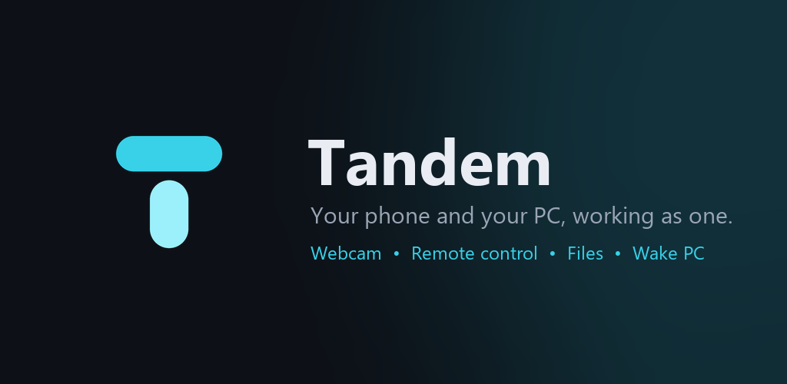

---

## What is Tandem?

Tandem is a private bridge between **one Android phone and one Windows PC** (or several of each). You pair them once by scanning a code. After that they find each other on their own, at home over Wi-Fi and away from home over an encrypted relay, and you get a set of tools that normally need several separate apps.

Nothing goes through an account, nothing is stored in the cloud, and there are no ads or trackers.

  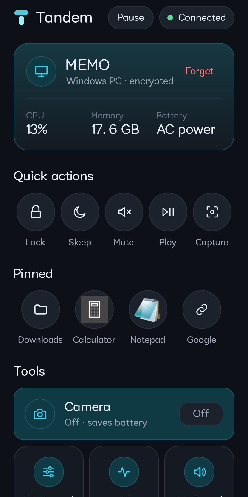
  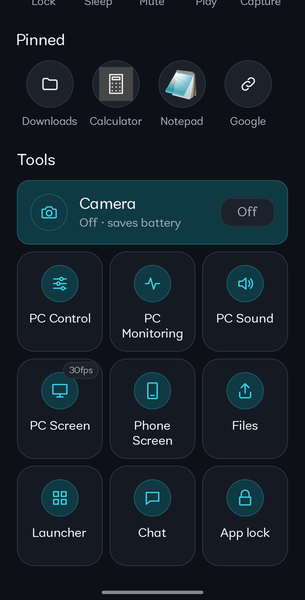
  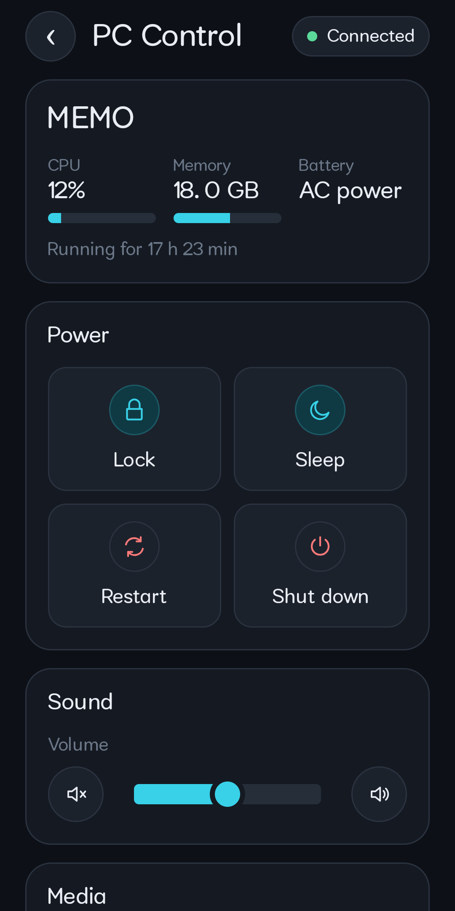
  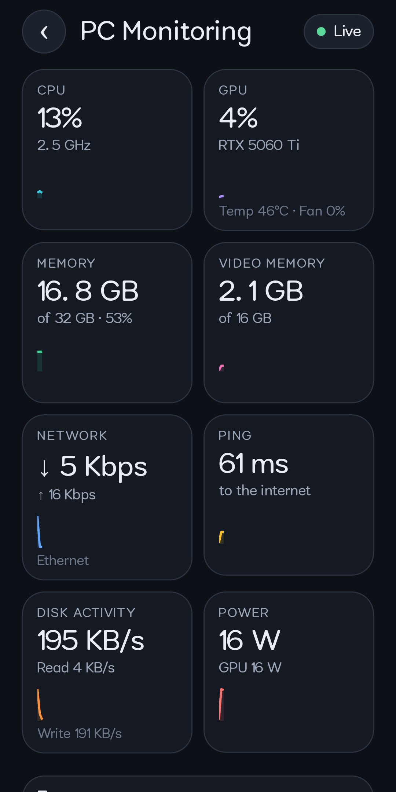

## What you can do

<table>
<tr>
<td width="190" valign="top"> <b>Phone as a webcam</b></td>
<td valign="top">Use the phone's camera as a PC webcam in Zoom, Discord, OBS, Teams and anything that lists a camera. Rotation, torch and quality are controlled from either side.</td>
</tr>
<tr>
<td width="190" valign="top"> <b>See and control your PC</b></td>
<td valign="top">Watch your PC screen on the phone and use it by touch: click, drag, scroll, zoom, type. Multi-monitor and rotated screens are supported. Quality adapts when you are on the internet instead of Wi-Fi.</td>
</tr>
<tr>
<td width="190" valign="top"> <b>Remote Start</b></td>
<td valign="top">Switch your PC on from anywhere. Wake-on-LAN from the phone, from a small always-on **wake station** (an old phone is enough) or through the relay. Handles sleep, hibernate and shut down, and can sign in for you.</td>
</tr>
<tr>
<td width="190" valign="top"> <b>Power and media</b></td>
<td valign="top">Lock, sleep, restart or shut down. Volume, media keys, presentation remote, play the PC's sound on the phone.</td>
</tr>
<tr>
<td width="190" valign="top"> <b>Files</b></td>
<td valign="top">Browse the PC from the phone and the phone from the PC. Send files and whole folders either way, with progress.</td>
</tr>
<tr>
<td width="190" valign="top"> <b>Chat</b></td>
<td valign="top">Notes, links, pictures and files between the two. Pictures open full screen with zoom. You choose the folder where received files are saved.</td>
</tr>
<tr>
<td width="190" valign="top"> <b>Shared clipboard</b></td>
<td valign="top">Copy on one device, paste on the other.</td>
</tr>
<tr>
<td width="190" valign="top"> <b>Launcher</b></td>
<td valign="top">A list of your PC's programs, folders and links, with their icons, one tap from the phone.</td>
</tr>
<tr>
<td width="190" valign="top"> <b>PC monitoring</b></td>
<td valign="top">CPU, GPU, memory, network, ping, disks, temperature and power, live on the phone.</td>
</tr>
<tr>
<td width="190" valign="top"> <b>Find my phone</b></td>
<td valign="top">Ring it, even on silent, and see its last location on a map. Location sharing is off until you turn it on.</td>
</tr>
<tr>
<td width="190" valign="top"> <b>Safe by design</b></td>
<td valign="top">Per-phone permissions, an audit log, an optional app PIN, and a **Pause** button that cuts the connection until you press it again. See [Security](#security-and-privacy).</td>
</tr>
<tr>
<td width="190" valign="top"> <b>Many phones, many PCs</b></td>
<td valign="top">Pair several phones to one PC, or one phone to several PCs, and choose which one is active.</td>
</tr>
</table>

More detail on every feature: [docs/FEATURES.md](docs/FEATURES.md).

## Get started in three steps

1. **Install Tandem on your PC.** Download [`Tandem-Setup.exe`](https://github.com/mhamdy2712/Tandem/releases/latest/download/Tandem-Setup.exe) and run it. It installs into your own user folder and creates a Start menu shortcut.
2. **Install the Android app.** In the PC app press **Install Tandem on my phone** and scan the code with your phone's camera, or download [`Tandem.apk`](https://github.com/mhamdy2712/Tandem/releases/latest/download/Tandem.apk) yourself. Android will ask you to allow the install once.
3. **Pair.** Open Tandem on the phone, tap Pair and scan the code on the PC. Done: they now reconnect on their own.

Step-by-step with pictures, including the screens Windows and Android show for apps that are not from their stores: **[docs/INSTALL.md](docs/INSTALL.md)**.

> **Heads-up about warnings.** Tandem is independent software and is not (yet) signed with a paid certificate. Windows SmartScreen may show *"Windows protected your PC"*: choose **More info → Run anyway**. Google Play Protect may show a warning on the phone: choose **More details → Install anyway**. Every release lists its SHA-256 checksums so you can verify the files. Details in the [install guide](docs/INSTALL.md#verifying-your-download).

## How it works

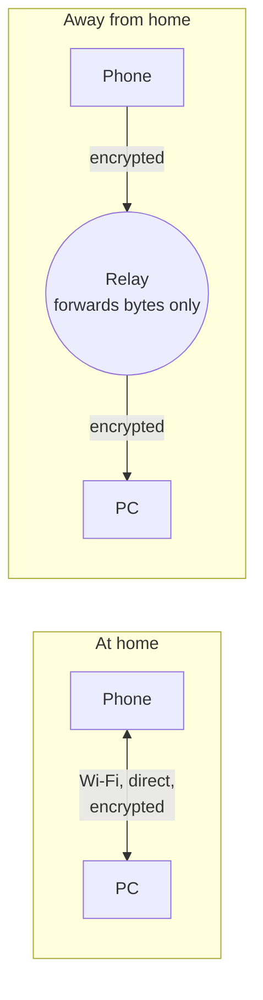

- **Home first.** Whenever both devices are on the same network, they talk directly. The relay is only the fallback and is never used if the direct path works.
- **End-to-end encrypted.** Everything between phone and PC is encrypted with a key made when you paired. The relay only sees opaque bytes: it cannot read your files, screen or messages.
- **No accounts.** Pairing is a one-time scan. Delete a pairing on either side and it is gone.

Read more: [docs/RELAY.md](docs/RELAY.md) · [docs/WAKE.md](docs/WAKE.md).

## Screenshots

### On the PC

  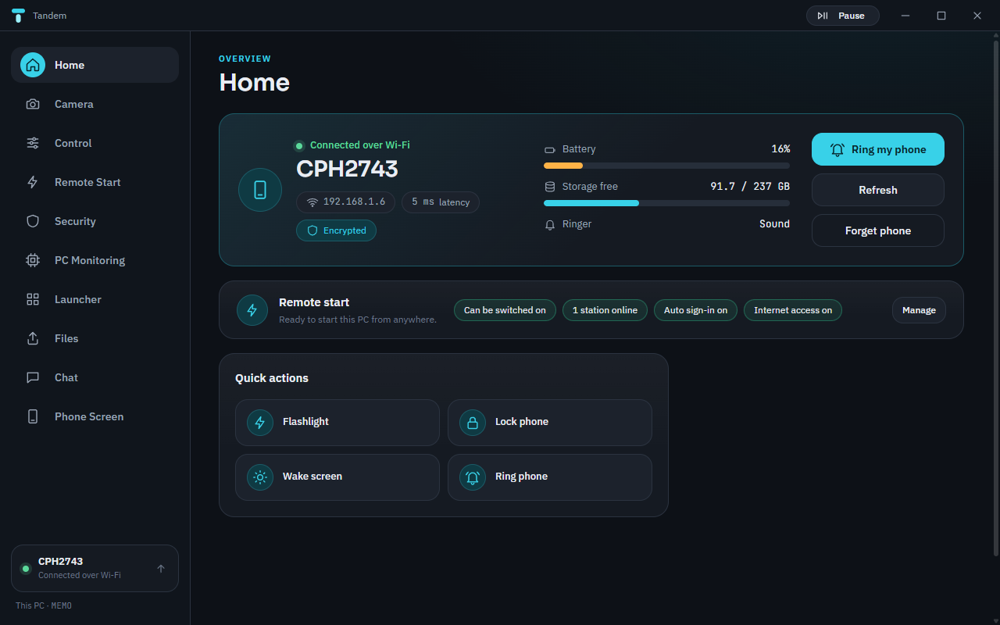
  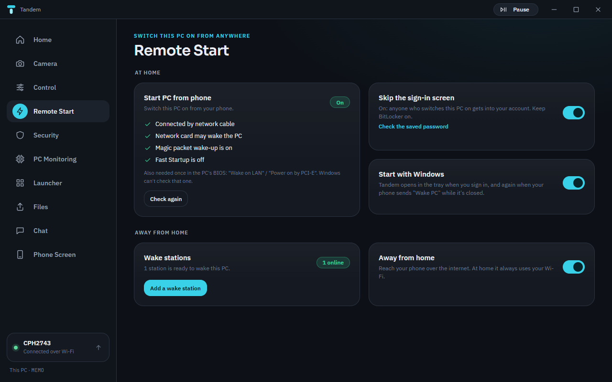

  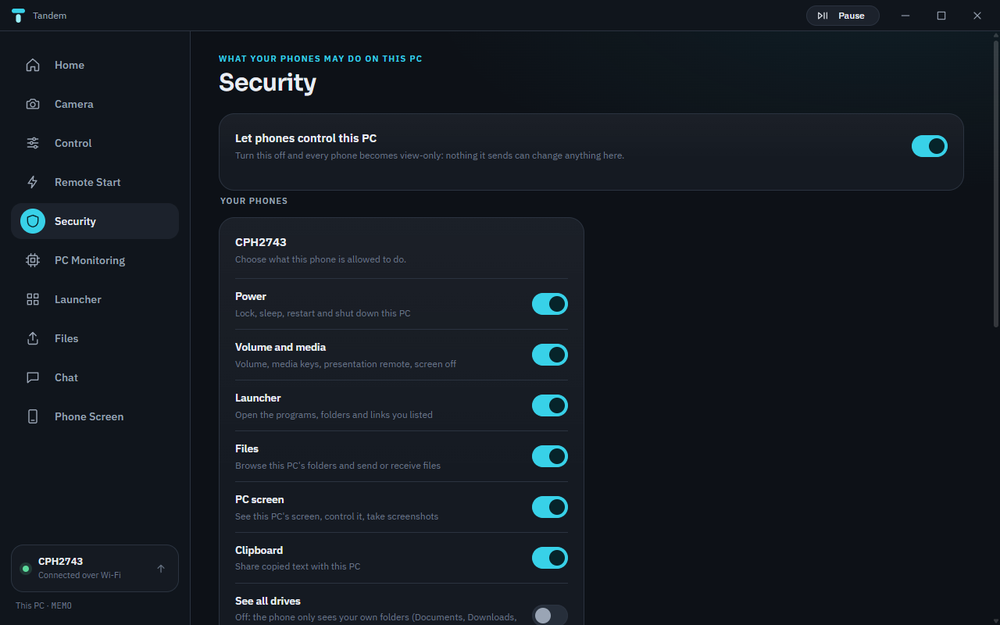
  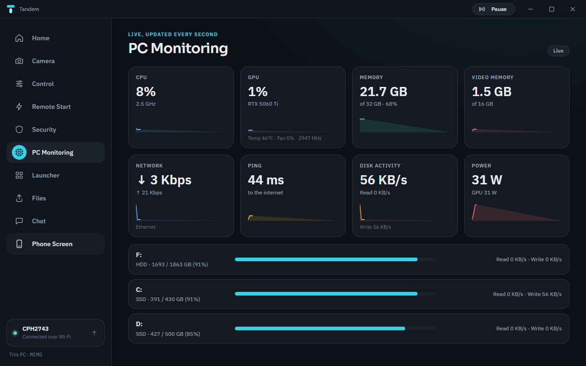

### On the phone

  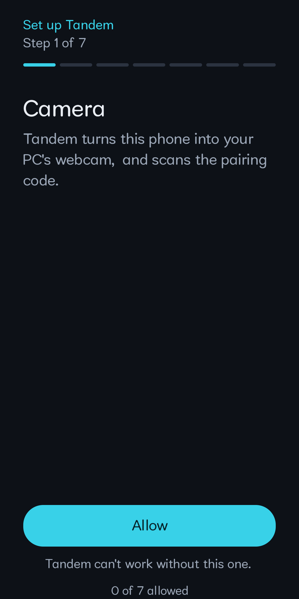
  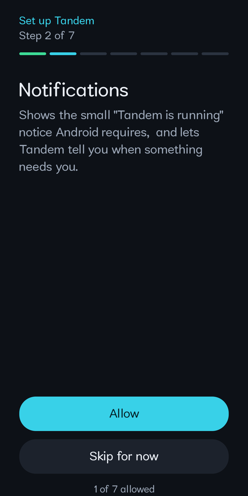
  
  

## Security and privacy

- **Encrypted end to end** with AES-256-GCM, keys derived (HKDF) from the secret created at pairing.
- **Keys are protected at rest**: Windows DPAPI on the PC, Android Keystore on the phone.
- **You decide what a phone may do.** Power, volume and media, launcher, files, PC screen, clipboard, even "see all drives": each is a switch on the PC, enforced on the PC, not in the phone app. A master switch makes every phone view-only.
- **Audit log** of sensitive actions and every blocked attempt.
- **Optional app PIN** on the phone with a growing delay after wrong tries, and the app hidden from screenshots while it is on.
- **Pause** stops all connections on either side until you resume.
- **Your data stays yours**: no account, no cloud storage, no analytics, no ads. Location, files and screen go only to your own paired devices.

Full details: [SECURITY.md](SECURITY.md) · [Privacy policy](https://mhamdy2712.github.io/Tandem/privacy.html).

## Requirements

| | |
|---|---|
| **PC** | Windows 10 or 11, 64-bit. A network card that supports Wake-on-LAN if you want Remote Start. |
| **Phone** | Android 8.0 or newer. |
| **Network** | Same Wi-Fi for the direct connection. Internet access for the away-from-home relay. |
| **Ports** (direct) | TCP 4810 (phone), 4811 (pairing) and 4812 (install page, only while shown). |

## Documentation

| | |
|---|---|
| [Install guide](docs/INSTALL.md) | Step by step for PC and phone, plus verifying downloads |
| [Features](docs/FEATURES.md) | Everything Tandem does and how to use it |
| [Remote Start](docs/WAKE.md) | Wake-on-LAN, wake stations, BIOS and network card settings |
| [The relay](docs/RELAY.md) | How the away-from-home connection works and what it can see |
| [FAQ](docs/FAQ.md) | Short answers to common questions |
| [Troubleshooting](docs/TROUBLESHOOTING.md) | When something does not connect |
| [Roadmap](docs/ROADMAP.md) | What is coming next |
| [Changelog](CHANGELOG.md) | What changed in each version |

## Support

Found a bug or have an idea? **[Open an issue](https://github.com/mhamdy2712/Tandem/issues/new/choose)** and include your Tandem version (shown in **Add or remove programs** on the PC and in the phone's app info) and what you were doing. For anything private, or just to say hello, write to **[mhamdy2712@gmail.com](mailto:mhamdy2712@gmail.com)**.

Security problems: please do **not** open a public issue. See [SECURITY.md](SECURITY.md).

## License

Tandem is free to use for personal purposes. The source code is not published, and the software is provided as it is, without warranty. See [LICENSE](LICENSE) for the full terms.

Made with care by <a href="https://github.com/mhamdy2712">mhamdy2712</a>

